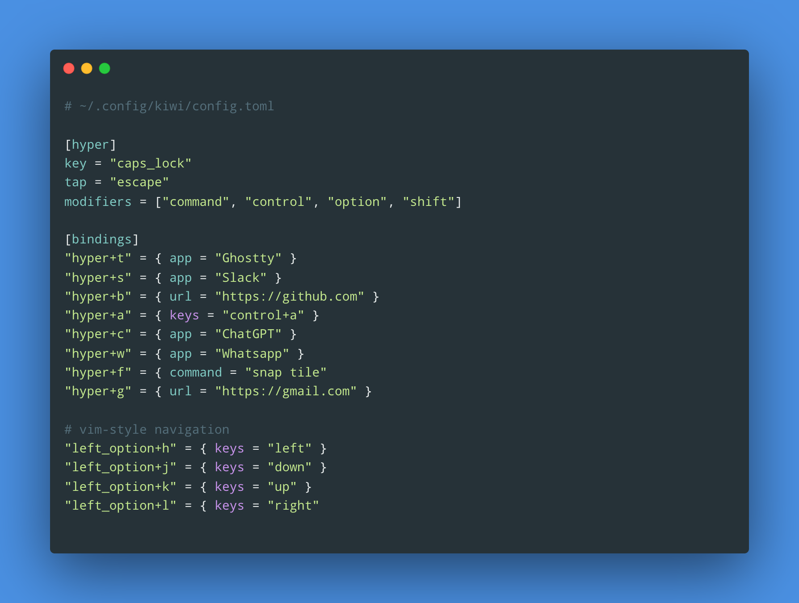

<div align="center">
  <h1>kiwi 🥝</h1>

  <p><strong>Run portable macOS key mappings</strong></p>

  <p>
    
    
    
    <a href="https://crates.io/crates/kiwi-keymapper"></a>
  </p>

  <p>
    
  </p>

  <p>
    <a href="#install">Install</a>
    &nbsp;·&nbsp;
    <a href="#quickstart">Quickstart</a>
    &nbsp;·&nbsp;
    <a href="#configuration">Configuration</a>
    &nbsp;·&nbsp;
    <a href="#commands">Commands</a>
  </p>

</div>

---

`kiwi` replaces the common Karabiner-Elements + launcher combination with one
small native daemon. It can turn Caps Lock into Hyper when held and Escape when
tapped, launch applications, open URLs, run shell commands, and emit other
keyboard shortcuts.

- One declarative TOML configuration
- Global shortcuts available in every application
- Caps Lock → Hyper/Escape dual-role key
- App, URL, command, and key-sequence actions
- Generic and side-specific modifiers
- Automatic config reloads, including symlinked dotfiles
- No Karabiner-Elements or Raycast dependency

<a id="install"></a>
## Install

```sh
brew install cesarferreira/tap/kiwi
kiwi install
```

`kiwi install` signs the binary with your stable Apple code-signing identity,
creates the LaunchAgent, and starts it. Run it again after each
`brew upgrade kiwi`, because the new binary needs to be signed and the
LaunchAgent needs to point at its new path.

A stable signature matters because macOS Accessibility permission is tied to the
identity of the executable. `kiwi install` prefers a **Developer ID
Application** identity, then an **Apple Development** identity. Check that macOS
can see one:

```sh
security find-identity -p codesigning -v
```

<a id="quickstart"></a>
## Quickstart

Open Accessibility settings, add the installed `kiwi` binary, and enable it:

```sh
kiwi permissions
```

Then create a config and start the daemon:

```sh
kiwi init
kiwi restart
kiwi doctor
```

The default configuration is `~/.config/kiwi/config.toml`:

```toml
[hyper]
key = "caps_lock"
tap = "escape"
modifiers = ["command", "control", "option", "shift"]

[ui]
feedback = "errors"
cheatsheet = true

[bindings]
# Launch or focus an app.
"hyper+t" = { app = "Ghostty" }

# Summon it, or hide it when it is already frontmost.
"hyper+s" = { app = "Slack", behavior = "toggle" }

# Open a URL or an application deep link.
"hyper+b" = { url = "https://github.com" }

# Run a command through /bin/zsh -lc.
"hyper+r" = { command = "/Users/me/.local/bin/open-project" }

# Emit another keyboard shortcut.
"hyper+a" = { keys = "control+a" }

# Side-specific modifiers work outside the Hyper layer.
"left_option+h" = { keys = "left" }

# Keep a binding in the file without activating it.
"hyper+x" = { command = "say disabled", enabled = false }
```

Run `kiwi validate` after editing. Unknown fields, invalid names, duplicate
normalized chords, and bindings with more or fewer than one action are rejected.

<a id="configuration"></a>
## Configuration

### `[hyper]`

Optional. Defines a dual-role key.

| Field | Meaning | Default |
|---|---|---|
| `key` | Physical key used as Hyper | `"caps_lock"` |
| `tap` | Key emitted when Hyper is pressed and released alone | `"escape"` |
| `modifiers` | Modifiers held while Hyper is down | `["command", "control", "option", "shift"]` |

When `caps_lock` is the Hyper key, `kiwi` owns a macOS `hidutil` mapping from
Caps Lock to F18, so F18 is reserved and should not be bound separately.

### `[ui]`

Optional. Controls action notifications and the Hyper cheatsheet overlay.

| Field | Values | Default |
|---|---|---|
| `feedback` | `"off"`, `"errors"`, or `"all"` | `"errors"` |
| `style` | `"notification"` | `"notification"` |
| `cheatsheet` | `true` or `false` | `true` |
| `cheatsheet_delay_ms` | `0` through `5000` | `1000` |

`errors` reports failed actions, `all` also reports successful ones, and `off`
disables feedback. Full command stderr stays in the Kiwi log. Notifications use
macOS `display notification`, so depending on the macOS version they may be
attributed to `osascript` and may need enabling in **System Settings →
Notifications**.

With `cheatsheet = true`, holding Hyper past `cheatsheet_delay_ms` shows a panel
listing every enabled Hyper binding. `kiwi validate` then rejects more than 64
enabled Hyper bindings so the overlay can show all of them; larger maps stay
valid with the cheatsheet off.

### `[bindings]`

Each entry maps a chord to an inline table with exactly one of `app`, `url`,
`command`, or `keys`. `enabled` is optional and defaults to `true`.

#### `app`

```toml
[bindings]
"hyper+t" = { app = "Ghostty" }
"hyper+return" = { app = "Ghostty", behavior = "toggle" }
"hyper+h" = { app = "Slack", behavior = "hide" }
"hyper+grave" = { app = "/Applications/Ghostty.app", behavior = "cycle" }
"hyper+n" = { app = "Safari", behavior = "new_window" }
"hyper+g" = { app = "com.mitchellh.ghostty" }
```

| Behavior | Meaning |
|---|---|
| `launch` | Launch or focus the app (default) |
| `toggle` | Launch when not running, activate when backgrounded, hide when frontmost |
| `hide` | Hide a running app without quitting it |
| `cycle` | Raise the next window of the running app, then activate it |
| `new_window` | Ask macOS for a new app instance/window |

App names, absolute `.app` paths, and bundle identifiers such as
`com.apple.Safari` are all supported. `toggle`, `hide`, and `cycle` never launch
the target while resolving it, and they need an Automation grant — see
[Troubleshooting](#troubleshooting).

#### `url`

Opens a URL with its registered macOS handler.

```toml
[bindings]
"hyper+g" = { url = "https://github.com" }
"hyper+c" = { url = "raycast://extensions/raycast/system/open-camera" }
"hyper+m" = { url = "mailto:hello@example.com" }
```

#### `command`

Runs a command asynchronously with `/bin/zsh -lc`. LaunchAgents receive a
minimal `PATH` (`/usr/bin:/bin:/usr/sbin:/sbin`), so use absolute paths or set
`PATH` inside the command. Commands run with your user privileges, so treat the
config as executable code.

```toml
[bindings]
"hyper+n" = { command = "/Users/me/.local/bin/new-note" }
"hyper+v" = { command = "pbpaste | /usr/bin/sed 's/^/→ /' | pbcopy" }
```

#### `keys`

Emits another key or chord. It may contain the regular modifiers below, but not
the virtual `hyper` modifier.

```toml
[bindings]
"hyper+a" = { keys = "control+a" }
"left_option+h" = { keys = "left" }
```

## Chord syntax

A chord is zero or more modifiers followed by one key, separated by `+`:

```text
hyper+t
command+shift+p
left_option+h
f12
```

Names are case-insensitive, `-` is normalized to `_`, and modifier order does
not matter, so `Command+Shift+P` and `shift+command+p` are the same chord and
cannot both be configured. A generic modifier such as `option` matches either
physical key, and a side-specific binding such as `left_option+h` takes
precedence over a generic `option+h`.

### Supported modifiers

| Name | Aliases |
|---|---|
| `hyper` | — |
| `command` | `cmd` |
| `control` | `ctrl` |
| `option` | `alt` |
| `shift` | — |
| `fn` | `function` |
| `left_command` / `right_command` | `left_cmd` / `right_cmd` |
| `left_control` / `right_control` | `left_ctrl` / `right_ctrl` |
| `left_option` / `right_option` | `left_alt` / `right_alt` |
| `left_shift` / `right_shift` | — |

### Supported keys

| Group | Names |
|---|---|
| Letters | `a` through `z` |
| Numbers | `0` through `9` |
| Function keys | `f1` through `f20` |
| Common keys | `caps_lock`, `escape`, `enter`, `tab`, `space`, `delete`, `forward_delete` |
| Navigation | `left`, `right`, `up`, `down`, `home`, `end`, `page_up`, `page_down` |
| Punctuation | `minus`, `equal`, `left_bracket`, `right_bracket`, `backslash`, `semicolon`, `quote`, `comma`, `period`, `slash`, `grave` |

Aliases: `esc` → `escape`, `return` → `enter`, `backspace` → `delete`, and
`left_arrow` / `right_arrow` / `up_arrow` / `down_arrow` → `left` / `right` /
`up` / `down`.

Key names use ANSI keyboard positions, so letter shortcuts stay tied to their
physical key when a different macOS input layout is active.

<a id="commands"></a>
## Commands

| Command | Purpose |
|---|---|
| `kiwi init` | Create the default config if it does not exist (`--force` to replace) |
| `kiwi validate` | Parse and validate the selected config |
| `kiwi list` | Print enabled shortcuts as a table |
| `kiwi list --conflicts` | Report shortcuts that collide with common app defaults |
| `kiwi listen` | Show resolved shortcuts live without executing actions |
| `kiwi run` | Run the daemon in the foreground |
| `kiwi install` | Validate, sign, install, and start the LaunchAgent |
| `kiwi start` / `stop` / `restart` | Control the installed LaunchAgent |
| `kiwi uninstall` | Remove the LaunchAgent and owned HID mapping |
| `kiwi status` | Print a LaunchAgent status summary |
| `kiwi doctor` | Check config, signing, Accessibility, and LaunchAgent health |
| `kiwi permissions` | Open macOS Accessibility settings |
| `kiwi config-path` | Print the active config path |

Global options: `--config <PATH>` selects a non-default configuration, and
`--format text|json` selects the output format for `list`, `listen`, and
`status` (`listen` emits NDJSON).

`kiwi listen` is read-only and safe to run alongside the daemon:

```text
hyper+t  matched  app  Ghostty (toggle)
hyper+p  matched  command  /Users/me/.local/bin/open-project
hyper+z  unmatched
```

## Dotfiles and automatic reloads

Keep the canonical file in your dotfiles and symlink it into place:

```sh
mkdir -p ~/.config/kiwi
ln -s ~/dotfiles/kiwi/config.toml ~/.config/kiwi/config.toml
kiwi validate
```

A custom path works too, and the LaunchAgent remembers it:

```sh
kiwi --config ~/dotfiles/kiwi/config.toml install
```

The daemon watches the selected config — symlinks included — and reloads valid
edits automatically at an idle key boundary, so an edit cannot split a held
chord. Invalid edits are logged and the last valid configuration keeps running.
Only a `[hyper].key` change requires `kiwi restart`.

<a id="troubleshooting"></a>
## Troubleshooting

**Caps Lock acts like normal Caps Lock.** Run `kiwi restart && kiwi doctor`, then
check `hidutil property --get UserKeyMapping` for a Caps Lock → F18 mapping. If
`doctor` reports an Accessibility problem, remove any stale `kiwi` entry, add the
binary again, enable it, and restart.

**`doctor` says the binary is ad-hoc signed.** Run `kiwi install` again. Avoid
finishing an update with only `cargo install`; it replaces the stable signature.

**A command works in Terminal but not from a binding.** The LaunchAgent has a
minimal `PATH`. Use an absolute path, or set `PATH` inside the command.

**A `hide`, `cycle`, or `toggle` binding does nothing.** These drive `System
Events` through `osascript`, which needs an Automation grant separate from
Accessibility. Enable `System Events` in **System Settings → Privacy & Security →
Automation** under the sending process. `kiwi doctor` cannot see that grant, so it
can report a healthy install while these stay blocked. Failures are logged:

```sh
tail -n 20 ~/Library/Logs/kiwi.log
```

**Two shortcuts are reported as duplicates.** Chord names are normalized, so
modifier order, aliases, case, and `-` versus `_` do not create distinct
shortcuts. Keep one form.

**Another HID mapping is already installed.** `kiwi` refuses to overwrite a
`UserKeyMapping` it does not own. Remove the software that created it, then run
`kiwi restart`.

<a id="performance"></a>
## Performance

`kiwi` stays asleep between keyboard events and keeps the event-tap callback
small. A release build measured on a 14-core Apple M4 Pro with macOS 26.6.2,
Rust 1.98.0, and ten configured bindings produced:

| Metric | Result |
|---|---:|
| Release binary | 1.01 MiB |
| Idle daemon | <0.1% sampled CPU, 3.3 MiB physical footprint |
| CLI startup and config validation | ~4.0 ms |
| Config parse and compile | ~5.5 µs |
| Ordinary key down/up cycle | ~20 ns |
| Mapped Hyper shortcut cycle | ~68 ns |
| Unmapped Hyper shortcut cycle | ~61 ns |

## License

[MIT](LICENSE)
